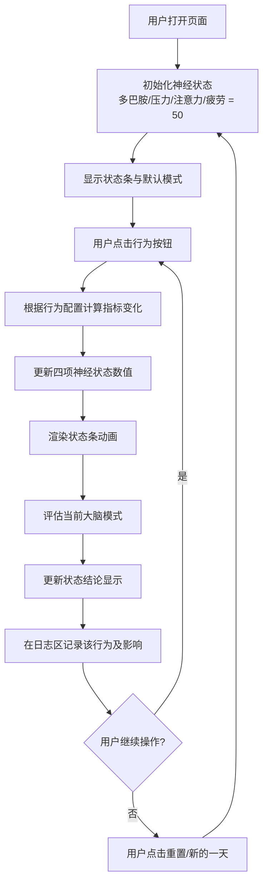

## 1. 产品概述

神经奖励系统模拟器是一款模拟人类大脑神经奖励机制的交互式网页应用。用户通过模拟日常行为（刷短视频、学习、运动等），观察多巴胺、压力值、注意力、疲劳值四项核心神经指标的动态变化，理解不同行为模式对大脑状态的影响。

- **核心目标**：以寓教于乐的方式，让用户直观理解神经科学中的奖励机制、成瘾原理、专注力与疲劳的关系
- **目标用户**：对神经科学、心理学、自我提升感兴趣的普通用户，以及学生和教育工作者
- **产品价值**：将抽象的神经科学概念转化为可交互、可感知的可视化体验

## 2. 核心功能

### 2.1 用户角色

| 角色 | 注册方式 | 核心权限 |
|------|----------|----------|
| 普通用户 | 无需注册，直接使用 | 完整使用所有模拟功能 |

### 2.2 功能模块

1. **神经状态面板**：实时显示四项核心神经指标（多巴胺、压力值、注意力、疲劳值）的可视化状态条与数值
2. **行为操作区**：8种日常行为按钮（刷短视频、学习、运动、喝咖啡、睡觉、熬夜、打游戏、社交）
3. **状态结论模块**：根据当前神经指标组合，智能判定并展示大脑所处模式（专注模式、疲劳模式、奖励依赖模式、平衡模式、焦虑模式）
4. **行为日志区**：记录用户每次行为操作及其对指标的影响
5. **模拟时间系统**：追踪虚拟"天数"，支持重置模拟

### 2.3 页面详情

| 页面名称 | 模块名称 | 功能描述 |
|----------|----------|----------|
| 主页面 | 神经状态面板 | 4个横向状态条，实时展示多巴胺、压力值、注意力、疲劳值的当前数值及百分比，配有数值范围颜色渐变 |
| 主页面 | 行为操作区 | 8个行为按钮按类别排列（娱乐类、提升类、生理类、社交类），每个按钮有图标和文字说明 |
| 主页面 | 状态结论模块 | 顶部显眼位置显示当前大脑模式，配有描述性文字说明该模式的特征和建议 |
| 主页面 | 行为日志区 | 可滚动区域，按时间顺序记录用户执行的每个行为及其对四项指标的增减量 |
| 主页面 | 模拟控制栏 | 显示当前天数，提供"新的一天"和"重置模拟"按钮 |

## 3. 核心流程

用户打开页面 → 查看初始神经状态（各项指标居中） → 点击任意行为按钮 → 系统根据行为配置计算指标变化 → 更新状态条显示 → 重新评估大脑模式 → 在日志区记录行为 → 循环操作或重置模拟

## 4. 用户界面设计

### 4.1 设计风格

- **美学方向**：赛博朋克 + 生物科技感。深色背景配合霓虹发光效果，体现神经科学的科技感与神秘感
- **主色调**：深靛蓝 `#0a0e27` 作为背景基底，紫色 `#7c3aed` 作为主品牌色
- **辅助色**：多巴胺用粉紫渐变 `#ec4899 → #a855f7`，压力用橙红渐变 `#f97316 → #ef4444`，注意力用青绿渐变 `#10b981 → #06b6d4`，疲劳值用黄褐渐变 `#eab308 → #78716c`
- **按钮风格**：圆角胶囊形，带内发光和悬浮时外发光动画，3D微浮雕效果
- **字体**：标题使用 Space Grotesk（等宽科技感），正文使用 Geist Sans（现代清晰）
- **布局风格**：三栏式布局，左侧状态面板，中间行为操作区，右侧日志区
- **图标风格**：使用 Emoji 配合发光效果，保持统一的圆润风格
- **动效**：状态条变化时带平滑过渡动画，点击按钮时有脉冲反馈，模式切换时有淡入淡出效果

### 4.2 页面设计概述

| 页面名称 | 模块名称 | UI 元素 |
|----------|----------|---------|
| 主页面 | 标题区 | 大字号标题"神经奖励系统模拟器"，副标题说明，带霓虹光晕文字效果 |
| 主页面 | 神经状态面板 | 每个状态条包含：指标名称 Emoji、当前数值、百分比进度条、范围刻度，进度条使用对应颜色渐变 |
| 主页面 | 状态结论模块 | 大号 Emoji 图标 + 模式名称 + 描述文字，整体为卡片样式，带对应模式的主题色发光边框 |
| 主页面 | 行为操作区 | 2行4列网格布局，每个按钮包含：Emoji 图标、行为名称、简短效果提示（如"多巴胺↑"） |
| 主页面 | 行为日志区 | 带时间轴样式的列表，每条记录显示行为、指标变化、虚拟时间 |
| 主页面 | 模拟控制栏 | 天数显示胶囊 + 两个操作按钮，位于页面底部或顶部 |

### 4.3 响应式

- 桌面端（≥1024px）：三栏式布局，状态条横向展示
- 平板端（768-1023px）：两栏布局，左侧状态+操作，右侧日志
- 移动端（<768px）：单栏垂直布局，从上到下依次为：状态结论 → 神经状态 → 行为操作 → 日志
- 所有触摸目标 ≥48px，适配移动端点击

## 5. 行为与指标配置

### 5.1 指标定义

| 指标 | 范围 | 说明 |
|------|------|------|
| 多巴胺 | 0-100 | 奖励与愉悦感指标，过高易成瘾，过低会抑郁 |
| 压力值 | 0-100 | 皮质醇水平，过高导致焦虑，过低缺乏动力 |
| 注意力 | 0-100 | 专注能力，过高易耗竭，过低无法集中 |
| 疲劳值 | 0-100 | 身心疲惫程度，过高需要休息恢复 |

### 5.2 行为效果表

| 行为 | 多巴胺 | 压力值 | 注意力 | 疲劳值 |
|------|--------|--------|--------|--------|
| 刷短视频 | +20 | +5 | -15 | +5 |
| 学习 | +5 | +10 | +20 | +10 |
| 运动 | +10 | -5 | +10 | +15 |
| 喝咖啡 | +5 | +15 | +15 | -10 |
| 睡觉 | -5 | -15 | +10 | -25 |
| 熬夜 | +10 | +20 | -20 | +20 |
| 打游戏 | +25 | +10 | -5 | +10 |
| 社交 | +15 | -10 | +5 | +5 |

### 5.3 模式判定规则

| 模式 | 判定条件 |
|------|----------|
| 专注模式 | 注意力 ≥ 70 且 疲劳值 ≤ 50 且 压力值 ≤ 60 |
| 疲劳模式 | 疲劳值 ≥ 70 |
| 奖励依赖模式 | 多巴胺 ≥ 80 且 注意力 ≤ 40 |
| 焦虑模式 | 压力值 ≥ 75 |
| 平衡模式 | 所有指标在 30-70 之间 |
| 低迷模式 | 多巴胺 ≤ 25 且 注意力 ≤ 40 |
