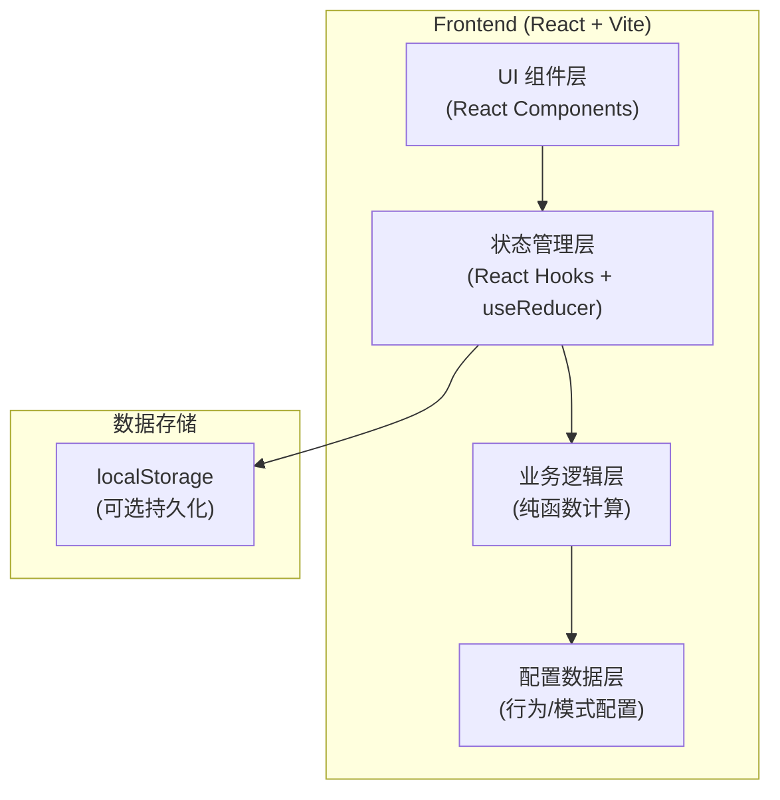

## 1. 架构设计



## 2. 技术说明

- **前端框架**：React@18 + TypeScript + Vite@6
- **样式方案**：TailwindCSS@3 + CSS Variables（主题色管理）
- **状态管理**：React useReducer（集中式状态管理，便于扩展）
- **图标方案**：Lucide React（配合 Emoji）
- **构建工具**：Vite
- **后端**：无（纯前端单页应用）
- **数据库**：无，使用 localStorage 可选持久化

## 3. 目录结构设计

```
src/
├── types/
│   └── index.ts          # 类型定义（指标、行为、模式、状态）
├── config/
│   ├── behaviors.ts      # 行为效果配置
│   └── modes.ts          # 模式判定规则配置
├── engine/
│   └── simulator.ts      # 核心模拟引擎（指标计算、模式判定）
├── hooks/
│   └── useSimulator.ts   # 自定义 Hook，封装 useReducer
├── components/
│   ├── StatusBar.tsx     # 单个状态条组件
│   ├── StatusPanel.tsx   # 状态面板（四个状态条集合）
│   ├── BehaviorButton.tsx # 单个行为按钮
│   ├── BehaviorGrid.tsx  # 行为操作区
│   ├── ModeDisplay.tsx   # 状态结论展示
│   ├── ActionLog.tsx     # 行为日志
│   └── ControlBar.tsx    # 模拟控制栏
├── App.tsx               # 主应用组件
├── main.tsx              # 入口
└── index.css             # 全局样式与 TailwindCSS
```

## 4. 核心类型定义

```typescript
// 神经指标类型
type MetricType = 'dopamine' | 'stress' | 'attention' | 'fatigue';

interface Metrics {
  dopamine: number;   // 多巴胺 0-100
  stress: number;     // 压力值 0-100
  attention: number;  // 注意力 0-100
  fatigue: number;    // 疲劳值 0-100
}

// 行为定义
interface Behavior {
  id: string;
  name: string;
  emoji: string;
  category: 'entertainment' | 'growth' | 'physiology' | 'social';
  effect: Partial<Metrics>;  // 各指标变化量
  description: string;       // 简短效果描述
}

// 模式定义
type ModeId = 'focus' | 'fatigue' | 'reward_dependency' | 'anxiety' | 'balance' | 'low';

interface Mode {
  id: ModeId;
  name: string;
  emoji: string;
  description: string;
  color: string;      // 主题色（十六进制）
  check: (metrics: Metrics) => boolean;  // 判定函数
}

// 日志条目
interface LogEntry {
  id: string;
  behaviorId: string;
  behaviorName: string;
  behaviorEmoji: string;
  effect: Partial<Metrics>;
  timestamp: number;
  day: number;
}

// 模拟器状态
interface SimulatorState {
  metrics: Metrics;
  day: number;
  logs: LogEntry[];
  currentMode: ModeId | null;
}

// 动作类型
type SimulatorAction =
  | { type: 'APPLY_BEHAVIOR'; behavior: Behavior }
  | { type: 'NEXT_DAY' }
  | { type: 'RESET' };
```

## 5. 核心算法设计

### 5.1 指标计算引擎

```typescript
// 将数值钳制在 0-100 范围内
function clamp(value: number, min = 0, max = 100): number {
  return Math.max(min, Math.min(max, value));
}

// 应用行为效果到当前指标
export function applyBehaviorEffect(
  currentMetrics: Metrics,
  effect: Partial<Metrics>
): Metrics {
  return {
    dopamine: clamp(currentMetrics.dopamine + (effect.dopamine ?? 0)),
    stress: clamp(currentMetrics.stress + (effect.stress ?? 0)),
    attention: clamp(currentMetrics.attention + (effect.attention ?? 0)),
    fatigue: clamp(currentMetrics.fatigue + (effect.fatigue ?? 0)),
  };
}
```

### 5.2 模式判定引擎

```typescript
// 按优先级顺序检查所有模式，返回第一个匹配的模式
// 优先级：疲劳 > 焦虑 > 奖励依赖 > 专注 > 低迷 > 平衡
export function evaluateMode(metrics: Metrics, modes: Mode[]): ModeId | null {
  for (const mode of modes) {
    if (mode.check(metrics)) {
      return mode.id;
    }
  }
  return null;
}
```

## 6. 扩展性设计

为支持后期迭代，系统采用以下可扩展设计：

| 扩展点 | 实现方式 | 说明 |
|--------|----------|------|
| 新增行为 | 在 `config/behaviors.ts` 中添加配置项 | 无需修改业务逻辑代码 |
| 新增指标 | 扩展 `Metrics` 类型 + `StatusPanel` 组件 + 引擎函数 | 状态层自动支持 |
| 新增模式 | 在 `config/modes.ts` 中添加判定规则 | 自动参与优先级判定 |
| 持久化 | 在 `useSimulator` Hook 中添加 localStorage 读写 | 对 UI 层透明 |
| 历史统计 | 在 `engine/` 下新增统计模块 | 不影响现有模拟逻辑 |
| 多语言 | 所有展示文本集中在配置层，后期接入 i18n | 文本与逻辑分离 |
